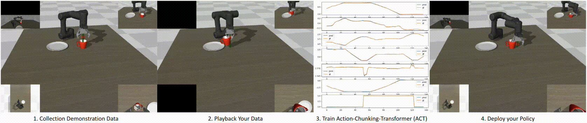

# robotis_mujoco_menagerie
A collection of models for the MuJoCo physics engine from ROBOTIS

## AI Worker (FFW-SH5)

## AI Worker (FFW-SG2)

## AI Worker (FFW-BG2)

## OpenMANIPULATOR-Y

## OMX

## OpenMANIPULATOR-X

## OP3

## TurtleBot3 Burger

## TurtleBot3 Waffle Pi

# Applications
The models in this repository are designed for use with the MuJoCo physics engine. They can be utilized in various applications, including but not limited to:

- [LeRobot Tutorial with MuJoCo](https://github.com/jeongeun980906/lerobot-mujoco-tutorial)
: Collecting demonstration data and training (or fine-tuning) vision language action models on custom datasets.

  

# Acknowledgments

This repository and its associated codebase were made possible through the dedicated efforts of the developers at [ROBOTIS](https://en.robotis.com/). The asset files for OP3 were developed by ROBOTIS, and we gratefully acknowledge the referenced XML model files utilized in the publicly available [OP3 model](https://github.com/google-deepmind/mujoco_menagerie/tree/main/robotis_op3).
Additionally, we extend our sincere appreciation to Professor Sungjoon Choi, Researcher Jihwan Yoon and Jeongeun Park from the [Robot Intelligence Lab](https://sites.google.com/view/sungjoon-choi/home) at Korea University for their valuable contributions and insightful collaboration.

# License
XML and asset files contained within each specific model directory of this repository are governed by their own distinct licensing conditions. Please refer to the LICENSE documentation located within each respective model's directory for comprehensive license terms and associated copyright details.

All other materials are the intellectual property of ROBOTIS CO., LTD., © 2025, and are made available under the Apache License, Version 2.0. The full text of this license is included in the main LICENSE file at the repository's root. Additionally, it is accessible online at https://www.apache.org/licenses/LICENSE-2.0.
# mujoco_robotis_aiworker_sim-
